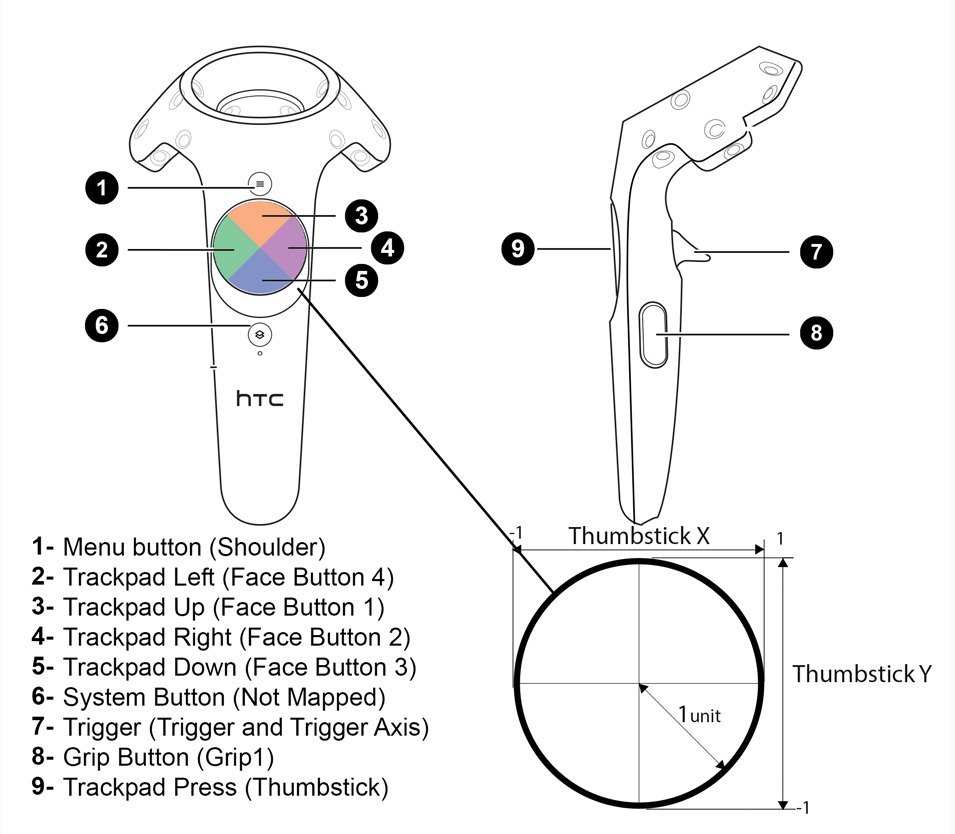

## UE 学习笔记

# 基础知识

开始 虚幻4 之旅
为刚开始使用虚幻引擎的游戏开发者提供的入门信息。
 

虚幻编辑器手册
使用和配置虚幻编辑器工具集的指南。
 

引擎的各个功能
使用虚幻引擎的工具和系统的完全指南。

编程指南
程序员使用虚幻引擎进行开发的信息。
 

蓝图 - 可视化脚本
关于使用蓝图可视化脚本系统制作游戏的概述。
 

游戏性指南
供程序员和可视化脚本设计师使用的游戏功能概述和示例。

示例与教学
连接到一些有用的示例场景, 游戏示例, 以及教学.
 

企业应用
将虚幻引擎用于汽车、航空、建筑、消费性电子产品，以及复杂数据的可视化应用
 

平台开发
在 PC 以外的平台开发游戏的信息。

版本信息
虚幻引擎版本的版本说明。
 

创建 Mod
打造 UE4 Mod 游戏的指南和资源

## UE4 Vive Controller Button map

[https://forums.unrealengine.com/development-discussion/vr-ar-development/78620-steam-vr-template?106609-Steam-VR-Template=](https://forums.unrealengine.com/development-discussion/vr-ar-development/78620-steam-vr-template?106609-Steam-VR-Template=)

