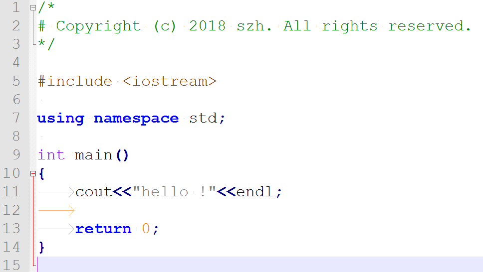
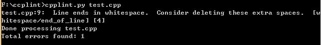

# C++代码规范和CodeReview

## 背景
最近手头上的开发工作基本已经完成主要功能，其后续进行的工作主要在细小功能的调整和完善上，周末在家看书，想到了CodeReview，想把这件事在组内推广下(其实CodeReview应该是在开发过程中进行的，现在提出，也是希望以后不要步此后尘）。

说道Review，那就不能不提代码规范。

## 项目中的规范问题：
1. **是否有编码规范的意识？**   
开发一个项目，若如果从开始编写第一行代码，大家就有代码规范的意识，确属难能可贵。但大多数情况，很多原因导致我们没有将此作为一项重要的原则开始。原因也大概无非以下几类：  

 - **时间原因**：项目开发时间紧迫，根本无法预期项目的进度，还是抓紧时间先实现功能再说
 - **软件原因**：项目开发使用的框架，第三方库各自有各自的编码风格
 - **个人原因**：每个人也有自己的编码习惯，一时间很难保持统一
 - **公司原因**：公司对编码要求、编码审核没有强制执行，没有专人负责，编码规范形同虚设，完全靠自觉，压根没谱
 - **其他**：这个很多时候，也有个人怕麻烦、懒啊、等等原因，总之，没能达到这要求，找借口一找一箩筐啊。

2. **选择什么样的规范作为标准呢？**      
这个主要根据编程语言的不同。不同编程语言有自己独特的特点，C++、Java、javaScript、Python等，语法规则相差很大，风格自然不同。对于不同变成语言，好多知名IT公司都有自己的编码规范，我们可以以此为参考。

3.**统一编程规范的意义有那些？**    
编程规范的形成，主要是为了团队之间更方便地代码阅读和交流为主要目的，同时也更容易从中分析代码错误。既然是为了别人阅读和交流，那就要更加通用和一致，这样才能有利于交流。 好多不注重规范的程序员写代码，都没有考虑代码最后给其他人看。所以写代码也相当随意。命名、注释、对齐，等等，完全随意。结果呢，几个星期过后，自己开自己代码都看不懂了，更别提给别人看。

## 谷歌的C++代码规范
目前，网上流传最广的没过于Google的[C++代码规范](https://google.github.io/styleguide/cppguide.html)，大家可以有时间进行学习。
Google编程规范：[https://github.com/google/styleguide](https://github.com/google/styleguide)

##代码审查
 "在Google，没有程序，任何产品、任何项目的程序代码，可以在没有经过有效的代码审查前提交到代码库里的"--- Mark CC [<<Things Everyone Should Do: Code Review>>](https://hacpai.com/article/1488949977089)

#### 1. 为什么要进行CodeReview
（1）CodeReview的目的提升代码质量，尽早发现常见、普通的缺陷与BUG降低修复成本，同时促进团队内部知识共享，帮助更多人更好地理解系统；

（2）保证组内人员良好的沟通，使得产品代码更容易维护；

#### 2. 从代码审查里能得到什么？（Mark CC）

- 在代码提交前，用第二群眼睛检查一遍，防止 bug 混入。

- **代码审查的最大的功用是纯社会性的**。如果你在编程，而且知道将会有同事检查你的代码，你编程态度就完全不一样了。你写出的代码将更加整洁，有更好的注释，更好的程序结构——因为你知道，那个你很在意的人将会查看你的程序。       
- 代码审查能传播知识。在很多的开发团队里，经常每一个人负责一个核心模块，每个人都只关注他自己的那个模块。除非是同事的模块影响了自己的程序，他们从不相互交流。

#### 进行CodeReview应该遵循哪些基本规则？

   （1）需要对CodeReview形成一致的认识，如果在对该事物的认识上存在分歧，那么会增加CodeReview工作的难度；

   （2）需要对基本的编码规范形成一致性的认知，即形成统一的代码规范；

   （3）CodeReview必须在代码CheckIn之前完成；

   （4）CodeReview应从设计到编码逻辑进行细致的review，故需要参与成员的紧密沟通合作；

   （5）必须准确记录CodeReview过程中发现的问题，可以使用问题点记录单；

   （6）Review过程中可以要求作者讲解，遇到不清楚的逻辑点要处分提问讨论；

   （7）要形成讨论问题、解决问题的气氛，不能把CodeReview搞成批判大会；

   （8）Code的作者应对Code质量负责；

   （9）引导轻量Review：如果一次性Review issue过多，会严重影响Review的质量；

## Google代码规范工具Cpplint的使用 

下面，来学习下CPPlint工具的使用：

##### 1. 准备测试代码：　

		#include <iostream>
		 
		using namespace std;
		 
		int main()
		{
			cout<<"hello !"<<endl;
			
			return 0;
		}

##### 2. 打开命令提示符，如下，会发现一共有9个错误        

11个错误：    
- 没有找到版权信息  
- 存在空行  
- 不要直接引用命名空间  
- 奇怪的空格在文件第五行开头   
- 制表位使用，这个不被推荐，最好使用空格  
- ...

##### 3. 按照提示修改问题，添加版权信息    

		

---

##### 4. 下一个问题：Line ends in whitespace (行以空格结尾），感觉应该指的是第6行是一个空行，建议删掉。  
 删除空行后显示：  

##### 5. 提示，命名空间被直接引用

##### 6. 提示存在奇异的空格在行起始

对于一般的编辑工具，都可以显示特殊治制表符和空格。  
**VS中**：  
  

**NotePad++中**：     
 

##### 7. 删除空行后，出现新的问题：   左括号应该位于上一行末尾
  

##### 8. 制表位，建议替换成空格
      
     
  

##### 9. << 符号应该有空格：
  

##### 10. 行末有空格   
   

##### 11. 总算完了 

  

### 短短的几行代码，问题如此多。    

## cpplint 的其他用法：

1. 控制输出警告的级别【1=5】： cpplint.py --verbose=3 test.cpp  

2. 支持对hpp的检测： cpplint.py --extensions=hpp test.cpp 

3. 输出日志到文件： cpplint.py --output test.cpp 2>log.txt 

4. 使用filter 过滤某些可忽略的警告： cpplint.py --filter=-whitespace test.cpp  

5. 将错误按照不同类型进行统计： cpplint.py --counting=detailed test.cpp 

6. 检测一行长度是否超出指定字符： cpplint.py --linelength=120 test.cpp  

7. 帮助 cpplint.py --help 

### 代码质量，任重道远。

## 执行代码ReView：
下一周，希望大家：自己先给自己代码 review，并写点总结    
### 给点建议： 
1. 选出一段代码（一个小功能代码：如一个类，或一个或几个功能函数） 
2. 对选中代码进行Review（检查：编码规范，逻辑是否正确，条件判断是否覆盖了整个逻辑，设计是否合理,代码性能，等） 
3. 对比原代码和修改后的代码，进行分析总结
4. 每个人先准备好演示文件，进行讲解，其他人来提问，来改进。
5. 个人ppt控制篇幅，不要太长（5-10分钟）。
6. 格式不限，自由发挥。

### reference:  
[让CodeReview成为一种团队习惯](https://blog.csdn.net/flyingleo1981/article/details/51620268)  
[Google代码规范工具Cpplint的使用](https://blog.csdn.net/fengbingchun/article/details/47341765)  
[如何进行高效迅速的CodeReview](https://blog.csdn.net/huver2007/article/details/75095303)