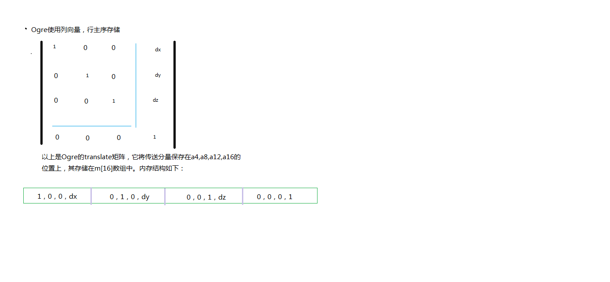

# 一、概念
 首先，无论dx还是opengl，所表示的矢量和矩阵都是依据线性代数中的标准定义的：
“矩阵A与B的乘积矩阵C的第i行第j列的元素c(ij)等于A的第i行于B的第j列的对应元素乘积的和。”（实用数学手册，科学出版社，第二版）
例如c12 = a11*b11+a12*b21+a12*b13...

# 二、矩阵的行、列存储(内存结构)
矩阵的行列存储，也叫行主序存储和列主序存储

- ##行主序的存储：  
行主序是指以行为优先单位，在内存中逐行存储: [Row1, Row2, Row3, Row4]

- ##列主序的存储：
列主序是指以列为优先单位，在内存中逐列存储:[Col1,Col2,Col3,Col4]
  

 
注意：矩阵的书写形式和内存形式
# 三、矩阵相乘：

### 左乘和右乘　　
　　左乘(left multiplication, pre-multication)和右乘(right multiplication, post-multication)，这里的左右、pre/post，
指的是矢量和矩阵相乘时，矢量的位置。对标量和矩阵相乘时，指标量的位置。

　　说简单点,左乘(又称前乘)就是乘在左边（即乘号前）,右乘（又称后乘）就是乘在右边（即乘号后）.
　　比如说,A左乘E即AE

### DirectX（行矩阵）：
 	v2 = v1 * ma * mb;　  

行矩阵变换矢量时，用行矢量乘以矩阵（v * M），如下。其中1、2、3为三个轴向矢量。  
 
		              　| x1 y1 z1 0 |
		　| x y z w | * | x2 y2 z2 0 |
		             　 | x3 y3 z3 0 |
		              　| xt yt zt 1 |
行矩阵之间乘法组合时，组合顺序为从左到右。例如依次做放缩S、旋转R、平移T，则组合为S * R * T。  
   
###OpenGL（列矩阵）:
 	v2 = mb(T) * ma(T) * v1      

列矩阵变换矢量时，用矩阵乘以列矢量（M * v），如下。其中1、2、3为三个轴向矢量。 

		　| x1 x2 x3 xt |   | x |
		　| y1 y2 y3 yt | * | y |
		　| z1 y2 y3 zt |   | z |
		　| 0  0  0  1  |   | w |
列矩阵之间乘法组合时，组合顺序为从右到左。例如依次做放缩S、旋转R、平移T，则组合为T * R * S。  

在OpenGL中4x4的矩阵用包含16个浮点数值的一维数组来表示（因为使用一维数组更高效），
要特别注意的是在矩阵中是使用列主序遍历数组的，即按列逐个遍历数组中的元素。

  

 事实上，这个矩阵里的16个值代表着空间中的一个特定的位置和三个轴的朝向（相对于视点坐标系）。前3列是方向向量分别代表着3个轴的朝向（绝大多数情况下，这3个向量是正交的），第四列用于平移变换、glTranslate函数就是把数值填到这一列中。这个4x4的矩阵相当于一个
坐标系统的位置和方向，如果把一个顶点（用列向量的形式）与这个矩阵相乘，得到的结果是一个变换到该坐标系统的新顶点。这意味着空间中的
任意一个点和方向，能够用唯一的4x4的矩阵表示。如果你把物体中的所有顶点都乘以这个矩阵，那么你就是把整个物体变换到空间中指定的位置
和朝向（我的理解是可以用这个矩阵所代表的坐标系统来表示你的整个物体）。

##总结：  
**OpenGL在内部，运算的形式是column-major的，并且最终在内存中保存的形式也是以column-vector数组的形式进行保存的（HLSL也相同）。**  

如果将以上矩阵采用c++数组实现：
class Matrix44 {
   float m[4][4];
}

// row-major order
x' = x * x1 + y * x2 + z * x3 + w * xt;
y' = x * y1 + y * y2 + z * y3 + w * yt;
z' = x * z1 + y * z2 + z * z3 + w * zt;
w' = w

可以看到在计算x’的值时，对数组内的取值并不是连续的(取第1, 5, 9的元素)，对于y'和z'的计算同样存在这个问题。实际上这样会潜在的影响CPU的缓存性能(不做展开…)。
解决的方案是采用列主序的形式：
 
// column-major order
x' = x * x1 + y * x2 + z * x3 + w * xt;
y' = x * y1 + y * y2 + z * y3 + w * yt;
z' = x * z1 + y * z2 + z * z3 + w * zt;
w' = w

x1,x2,x3 位于连续内存中，对于cpu缓存可以提升性能。

###OpenGL 示例：

		// 加载单位矩阵
		GLfloat m[] = { 1.0f, 0.0f, 0.0f, 0.0f,      // X 列
		0.0f, 1.0f, 0.0f, 0.0f,      // Y 列
		0.0f, 0.0f, 1.0f, 0.0f,      // Z 列
		0.0f, 0.0f, 0.0f, 1.0f };    // 平移列
		glMatrixMode(GL_MODELVIEW);
		glLoadMatrixf(m);

相对应的OpenGL还提供了加载行主序的矩阵的两个函数  
void glLoadTransposeMatrixf(GLfloat *m);  
void glLoadTransposeMatrixd(GLdouble *m);  

#  四、各个引擎使用的矩阵：
osg:
ogre

GLSL:  　存储方式和OpenGL相同(column-major)
HLSL：　 存储方式和DirectX相反(column-major)

opengl	右手坐标系 	列向量 	左乘 	列主序存储矩阵		调用API形成的矩阵用来和一个列向量相乘
d3d		左手坐标系  	行向量 	右乘 	行主序存储矩阵        调用API形成的矩阵用来和一个行向量相乘
osg		右手坐标系 	行向量 	右乘 	行主序存储矩阵		
CryEngine 右手坐标系 列向量   左乘     行主序存储矩阵    

ogre	右手坐标系  	列向量 	左乘 	行主序存储矩阵

Unreal  							列主序存储矩阵
## 1. Opengl和D3D中的矩阵
　
   Opengl采用的是列优先，D3D采用的是行优先。
　  抛开不同底层实现的差异，在进行模型视图变换时，一般的顺序都是先缩放，然后旋转，最后进行平移，这样才能达到正确的变换效果。
因此对于opengl:   

		V`=T*R*S*V;
但是对于D3D:

		V`=V*S*R*T。
##2. CryEngine

##3. OSG中的矩阵

　 osg的底层为opengl,但是在其矩阵实现时，是按照行矩阵来实现，矩阵的内部存储使用一个二维数组，这样在glLoadMatrix访问的刚好是osg的矩阵的的转置,
可以这样理解这个区别：

　　对于opengl，V`=M*V，根据矩阵运算法则：V`转置 = V转置 * M转置，矢量的转置不影响我们的使用，这样我们可以在osg中把矩阵当成行矩阵对待，因此在变换顺序上为S * R * T，
这样也更符合从左到右的习惯。

## 4.Ogre

ogre 支持opengl,d3d,opengl与ogre上层矩阵库运算顺利相同，

但opengl api设置矩阵前需要修改矩阵的存储顺序为列主序,可参考Ogre源码：

	  		GLfloat mat[16];
	        makeGLMatrix( mat, mViewMatrix * mWorldMatrix );
	        glMatrixMode(GL_MODELVIEW);
	        glLoadMatrixf(mat);   
————————————————————————————————————————————————————————————————————————

    void GLRenderSystem::makeGLMatrix(GLfloat gl_matrix[16], const Matrix4& m)
    {
        size_t x = 0;
        for (size_t i = 0; i < 4; i++)
        {
            for (size_t j = 0; j < 4; j++)
            {
                gl_matrix[x] = m[j][i];
                x++;
            }
        }
    }

d3d使用右乘，ogre上层运算的矩阵应用到d3d api前需要转置处理，

d3d使用与ogre不同的坐标系，设置ogre的ViewMatrix到d3d api前取反look方向（view坐标系z轴）

	Ogre使用的是列向量： 
/** \addtogroup Math
    *  @{
    */
    /** Class encapsulating a standard 4x4 homogeneous matrix.
        @remarks
            OGRE uses column vectors when applying matrix multiplications,
            This means a vector is represented as a single column, 4-row
            matrix. This has the effect that the transformations implemented
            by the matrices happens right-to-left e.g. if vector V is to be
            transformed by M1 then M2 then M3, the calculation would be
            M3 * M2 * M1 * V. The order that matrices are concatenated is
            vital since matrix multiplication is not commutative, i.e. you
            can get a different result if you concatenate in the wrong order.
        @par
            The use of column vectors and right-to-left ordering is the
            standard in most mathematical texts, and is the same as used in
            OpenGL. It is, however, the opposite of Direct3D, which has
            inexplicably chosen to differ from the accepted standard and uses
            row vectors and left-to-right matrix multiplication.
   
    
            The generic form M * V which shows the layout of the matrix
            entries is shown below:
            <pre>
                [ m[0][0]  m[0][1]  m[0][2]  m[0][3] ]   {x}
                | m[1][0]  m[1][1]  m[1][2]  m[1][3] | * {y}
                | m[2][0]  m[2][1]  m[2][2]  m[2][3] |   {z}
                [ m[3][0]  m[3][1]  m[3][2]  m[3][3] ]   {1}
            </pre>

		inline Vector4 operator * (const Vector4& v) const
		        {
		            return Vector4(
		                m[0][0] * v.x + m[0][1] * v.y + m[0][2] * v.z + m[0][3] * v.w,
		                m[1][0] * v.x + m[1][1] * v.y + m[1][2] * v.z + m[1][3] * v.w,
		                m[2][0] * v.x + m[2][1] * v.y + m[2][2] * v.z + m[2][3] * v.w,
		                m[3][0] * v.x + m[3][1] * v.y + m[3][2] * v.z + m[3][3] * v.w
		                );
		        }

参考：
OpenGL 官方提问回答：
For programming purposes, OpenGL matrices are 16-value arrays with base vectors laid out contiguously in memory. The translation components occupy the 13th, 14th, and 15th elements of the 16-element matrix, where indices are numbered from 1 to 16 as described in section 2.11.2 of the OpenGL 2.1 Specification.

Column-major versus row-major is purely a notational convention. Note that post-multiplying with column-major matrices produces the same result as pre-multiplying with row-major matrices. The OpenGL Specification and the OpenGL Reference Manual both use column-major notation. You can use any notation, as long as it's clearly stated.

Sadly, the use of column-major format in the spec and blue book has resulted in endless confusion in the OpenGL programming community. Column-major notation suggests that matrices are not laid out in memory as a programmer would expect.

  为了编程的目的，OpenGL矩阵是16值数组，其基本向量在存储器中连续布置。 传送（translation）组件占据矩阵16个元素的第13个，第14个和第15个元素，其中索引从1到16编号，如OpenGL 2.1规范的2.11.2节所述。

   列主序与列主序纯粹是一个标志性公约。 请注意，使用列主矩阵进行后乘法产生与预先乘以行主矩阵相同的结果。  OpenGL规范和OpenGL参考手册都使用列主矩阵。 
只要明确说明，就可以使用任何矩阵。

可悲的是，在规范和蓝皮书中使用列主要格式导致了OpenGL编程社区的无限混乱。 列主要表示法表明，矩阵不是按程序员期望的方式布置在内存中。

[https://www.opengl.org/archives/resources/faq/technical/transformations.htm](https://www.opengl.org/archives/resources/faq/technical/transformations.htm)

reference:   
[http://www.cnblogs.com/zengqh/archive/2012/07/09/2583079.html](http://www.cnblogs.com/zengqh/archive/2012/07/09/2583079.html)  
[http://www.cnblogs.com/dragon2012/p/5147382.html](http://www.cnblogs.com/dragon2012/p/5147382.html)
[http://www.cnblogs.com/zzugis/p/5061534.html](http://www.cnblogs.com/zzugis/p/5061534.html)
[http://www.cnblogs.com/kex1n/archive/2013/08/07/3243591.html](http://www.cnblogs.com/kex1n/archive/2013/08/07/3243591.html)
[http://www.linuxidc.com/Linux/2015-02/113995.htm](http://www.linuxidc.com/Linux/2015-02/113995.htm)
[http://blog.csdn.net/i_dovelemon/article/details/51627209](http://blog.csdn.net/i_dovelemon/article/details/51627209)