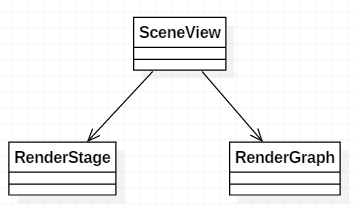
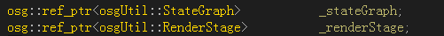
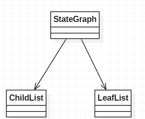
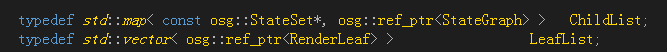
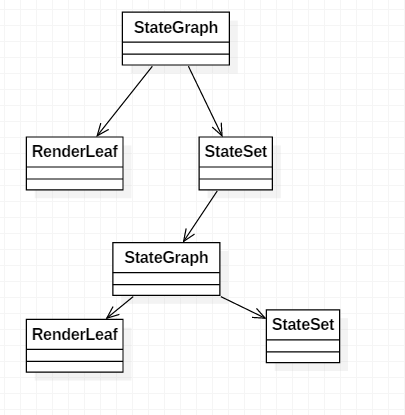

# OSG Render Flow

reference:  
[http://www.blogjava.net/wangle/archive/2007/08/30/134795.html](http://www.blogjava.net/wangle/archive/2007/08/30/134795.html)  
[http://blog.csdn.net/wang15061955806/article/details/50476255](http://blog.csdn.net/wang15061955806/article/details/50476255)  

**osg存在两棵树，场景树和渲染树**

&nbsp;&nbsp; &nbsp; &nbsp; 场景树是一颗Node组成的树，这些Node可能是矩阵变换，或者是状态切换，或者是真正的可绘制对象，它既反映了场景的空间结构，也反映了对象的状态。而渲染树则是一颗以StateSet和RenderLeaf为节点的树，它可以做到StateSet相同的RenderLeaf同时渲染从而不用切换Opengl状态，并且做到尽量少的在多个不同State间切换。渲染树在CullVisitor的cull过程中逐渐创建。   
  
SceneView包含两个与渲染相关的两个成员:一个RenderStage对象与StateGraph对象,定义如下：  
		
		osg::ref_ptr<osgUtil::StateGraph>           _stateGraph;
		osg::ref_ptr<osgUtil::RenderStage>          _renderStage;

 

StateGraph顾名思义，就是以状态为节点的图。   

  

		typedef std::map< const osg::StateSet*, osg::ref_ptr<StateGraph> >   ChildList;
		typedef std::vector< osg::ref_ptr<RenderLeaf> >                 	 LeafList;

        ChildList                           _children;
        LeafList                            _leaves;

StateGraph包含了真正的可渲染对象RenderLeaf的一个List，但是一个StateGraph是不够的，因为不同的RenderLeaf可能会有不同的StateSet，于是StateGraph内部包含一个以StateSet为key，StateGraph为value的Map对象，从而形成一颗渲染树

渲染时以该渲染树为基准按一定顺序逐渐渲染各个RenderLeaf。以何种方式遍历该树呢，这正是RenderStage的任务。

## RenderStage从RenderBin派生:

！[RenderBin_RenderStage](res/RenderBin_RenderStage）

RenderStage包含两种类型的RenderBin，透明与不透明的。对于Transparent RenderBin比较难处理，就是必须按深度顺序调用gl函数渲染对象，否则可能半透明会有问题。对于Opaque RenderBin则没有此限制，它只需按照尽量少切换状态的原则排列StateGraph即可。

StateSet的SetRenderingHint函数可以用来控制使用那个RenderBin进行渲染，题外话，StateSet的setAttributeAndModes函数可以指定AlphaFunc与BlendFunc，前者功能相当于Alpha测试，后者则反映了Alpha混合的方式。使用方式类似下面：

BlendFunc* func = new BlendFunc();

func->setFunction(...);

dstate->setAttributeAndModes(func, StateAttribute::ON);

 

可以参考的相关osg代码：

void CullVisitor::apply(Geode& node)

void CullVisitor::addDrawableAndDepth(osg::Drawable* drawable,osg::RefMatrix* matrix,float depth)

StateGraph的部分函数。。。

void RenderLeaf::render(State& state,RenderLeaf* previous)

void RenderBin::drawImplementation(osg::State& state,RenderLeaf*& previous)

void RenderStage::drawImplementation(osg::State& state,RenderLeaf*& previous)

OSG渲染排序是怎么做的，有哪些接口可以用来控制渲染顺序？

答：OSG通过场景拣选（cull）生成一棵由RenderStage（根节点）、RenderBin（分支节点）和RenderLeaf（渲染叶）构成的渲染树，同时生成一棵由StateGraph构成的渲染状态树，最终的渲染操作通过渲染树进行，渲染的顺序为：
 RenderStage::draw
                          |
 RenderStage::drawPreRenderStages
                          |
 RenderStage::drawInner ------------------------------------------- RenderBin::draw
                          |                                                                                          |
 RenderStage::drawPostRenderStages                                   BinNum小于0的子Bin（按BinNum升序） 
                                                                                                                     |
                                                                                                 本Bin的渲染叶列表（排序的）
                                                                                                                     |
                                                                                                 本Bin下挂的所有StateGraph中的渲染叶
                                                                                                                      |
                                                                                                   其他的子Bin（按BinNum升序）
在 拣选过程中，通过拣选测试的Drawable对象被添加到当前StateGraph对象的渲染叶列表中，而StateGraph则被当前 RenderBin对象引用，而最终渲染时，部分渲染叶也是通过RenderBin引用的StateGraph对象找到并渲染的，其他渲染叶（对应 RenderBin的排序模式为FRONT_TO_BACK/BACK_TO_FRONT/TRAVERSAL_ORDER的）被转移到 RenderBin的渲染叶列表中排序然后渲染。
我们可以通过StateSet的BinNum和BinName设置来控制对应节点的渲染顺序。
1）BinName为"RenderBin"、"StateSortedBin"的缺省排序方式为SORT_BY_STATE（目前实现为不排序）
   BinName为"DepthSortedBin"的缺省排序方式为SORT_BACK_TO_FRONT（由远到近，用于半透物体的alpha混合）
   BinName为"TraversalOrderBin"的缺省排序方式为TRAVERSAL_ORDER（即按遍历到的先后顺序排序）。
2）BinNum小的靠前渲染
3）setNestRenderBins设置RenderBin是否允许嵌套，为true时新的RenderBin被添加为当前RenderBin的子节点，为false时新的RenderBin被添加为RenderStage（根节点）的子节点。