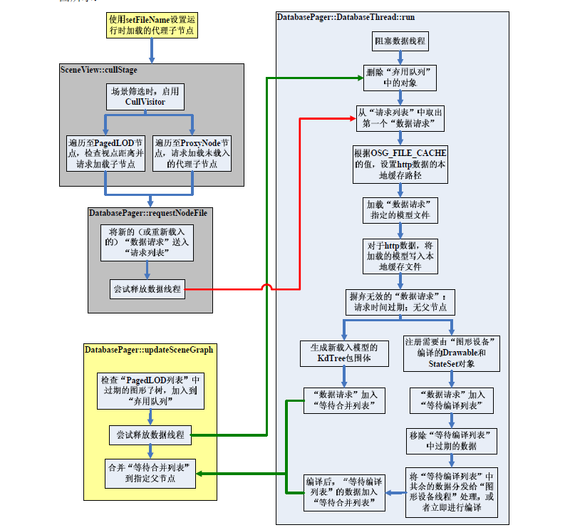
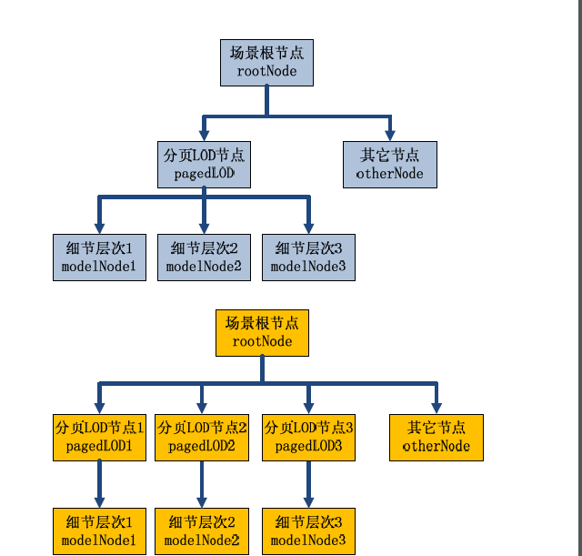
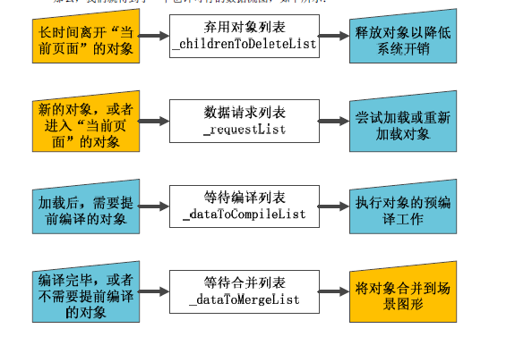

# osg 动态调度

http://www.doc88.com/p-9139975388619.html
## DataBasePager

## 1. 调度机制：  

两种场景结构图对比:  

## 2.多线程 使用DatabasePager加载数据的流程:

   

  左侧的图框表示数据的检索和输入， 中间的白色框表示用于数据存储的内存空间，而右边的图框表示存储数据的输出。此外，蓝色图框表示可以在DatabaseThread线程中完成的工作， 而橙色图框表示由线程之外的函数完成的工作。

## 3. DataBasePager的加载线程数目：
 可以由 osg::DisplaySettings 设置 DataBasePager的加载线程数目。  

		 setUpThreads(
		        osg::DisplaySettings::instance()->getNumOfDatabaseThreadsHint(),
		        osg::DisplaySettings::instance()->getNumOfHttpDatabaseThreadsHint());

setUpThreads 内部调用addDatabaseThread 启动线程：  
	unsigned int DatabasePager::addDatabaseThread(DatabaseThread::Mode mode, const std::string& name)
	{
	    OSG_INFO<<"DatabasePager::addDatabaseThread() "<<name<<std::endl;
	
	    unsigned int pos = _databaseThreads.size();
	
	    DatabaseThread* thread = new DatabaseThread(this, mode,name);
	    _databaseThreads.push_back(thread);
	
	    if (_startThreadCalled)
	    {
	        OSG_INFO<<"DatabasePager::startThread()"<<std::endl;
	        thread->startThread();
	    }
	
	    return pos;
	}

## 4. 加载线程： DatabasePager::DatabaseThread::run  

do.. while 循环：
 4.1  delete any children if required.
 4.2 

_____________________________________________________________________
# 加载流程：

1. Request:

	1.1 确定 required_range:  
    若为：  
		DISTANCE_FROM_EYE_POINT mode :  

		 required_range = nv.getDistanceToViewPoint(getCenter(),true);  
	否则：

	 		osg::CullStack* cullStack = dynamic_cast<osg::CullStack*>(&nv);
            if (cullStack && cullStack->getLODScale()>0.0f)
            {
                required_range = cullStack->clampedPixelSize(getBound()) / cullStack->getLODScale();
            }
            else
            {
                // fallback to selecting the highest res tile by
                // finding out the max range
                for(unsigned int i=0;i<_rangeList.size();++i)
                {
                    required_range = osg::maximum(required_range,_rangeList[i].first);
                }
            }

	1.2 更新stamp，并确定是否要加载：  

			int lastChildTraversed = -1;
            bool needToLoadChild = false;
            for(unsigned int i=0;i<_rangeList.size();++i)
            { // 请求的范围是否在某个Range中
                if (_rangeList[i].first<=required_range && required_range<_rangeList[i].second)
                {
                    if (i<_children.size())
                    {
                        if (updateTimeStamp)
                        {
                            _perRangeDataList[i]._timeStamp=timeStamp;
                            _perRangeDataList[i]._frameNumber=frameNumber;
                        }

                        _children[i]->accept(nv);
                        lastChildTraversed = (int)i;
                    }
                    else // 当请求范围大于children数目，load 新node
                    {
                        needToLoadChild = true;
                    }
                }
	            }

	1.3  计算优先级，并添加到request列表：  

		// now request the loading of the next unloaded child.
		if (!_disableExternalChildrenPaging &&
		    nv.getDatabaseRequestHandler() &&
		    numChildren<_perRangeDataList.size())
		{
		    // compute priority from where abouts in the required range the distance falls.
		    float priority = (_rangeList[numChildren].second-required_range)/(_rangeList[numChildren].second-_rangeList[numChildren].first);
		
		    // invert priority for PIXEL_SIZE_ON_SCREEN mode
		    if(_rangeMode==PIXEL_SIZE_ON_SCREEN)
		    {
		        priority = -priority;
		    }
		
		    // modify the priority according to the child's priority offset and scale.
		    priority = _perRangeDataList[numChildren]._priorityOffset + priority * _perRangeDataList[numChildren]._priorityScale;
		
		    if (_databasePath.empty())
		    {
		        nv.getDatabaseRequestHandler()->requestNodeFile(_perRangeDataList[numChildren]._filename,nv.getNodePath(),priority,nv.getFrameStamp(), _perRangeDataList[numChildren]._databaseRequest, _databaseOptions.get());
		    }
		    else
		    {
		        // prepend the databasePath to the child's filename.
		        nv.getDatabaseRequestHandler()->requestNodeFile(_databasePath+_perRangeDataList[numChildren]._filename,nv.getNodePath(),priority,nv.getFrameStamp(), _perRangeDataList[numChildren]._databaseRequest, _databaseOptions.get());
		    }
		}
	
    1.4 requestNodeFile 详解：

		void DatabasePager::requestNodeFile(const std::string& fileName, osg::NodePath& nodePath,
		                                    float priority, const osg::FrameStamp* framestamp,
		                                    osg::ref_ptr<osg::Referenced>& databaseRequestRef,
		                                    const osg::Referenced* options)
		{
		    osgDB::Options* loadOptions = dynamic_cast<osgDB::Options*>(const_cast<osg::Referenced*>(options));
		    if (!loadOptions)
		    {
		       loadOptions = Registry::instance()->getOptions();
		    }
		    else
		    {
		        // OSG_NOTICE<<"options from requestNodeFile "<<std::endl;
		    }
		
			// 不是新请求，则返回
		    if (!_acceptNewRequests) return;
		
		
			// 路径为空，则返回
		    if (nodePath.empty())
		    {
		        OSG_NOTICE<<"Warning: DatabasePager::requestNodeFile(..) passed empty NodePath, so nowhere to attach new subgraph to."<<std::endl;
		        return;
		    }
		
			// 获得 group节点
		    osg::Group* group = nodePath.back()->asGroup();
		    if (!group)
		    {
		        OSG_NOTICE<<"Warning: DatabasePager::requestNodeFile(..) passed NodePath without group as last node in path, so nowhere to attach new subgraph to."<<std::endl;
		        return;
		    }
		
		    osg::Node* terrain = 0;
		    for(osg::NodePath::reverse_iterator itr = nodePath.rbegin();
		        itr != nodePath.rend();
		        ++itr)
		    {
		        if ((*itr)->asTerrain()) terrain = *itr;
		    }
		
			// 更新 frameNumber
		    double timestamp = framestamp?framestamp->getReferenceTime():0.0;
		    unsigned int frameNumber = framestamp?framestamp->getFrameNumber():static_cast<unsigned int>(_frameNumber);
		
		// #define WITH_REQUESTNODEFILE_TIMING
		#ifdef WITH_REQUESTNODEFILE_TIMING
		    osg::Timer_t start_tick = osg::Timer::instance()->tick();
		    static int previousFrame = -1;
		    static double totalTime = 0.0;
		
		    if (previousFrame!=frameNumber)
		    {
		        OSG_NOTICE<<"requestNodeFiles for "<<previousFrame<<" time = "<<totalTime<<std::endl;
		
		        previousFrame = frameNumber;
		        totalTime = 0.0;
		    }
		#endif
		
			// 判断 文件是否以经在已加载列表中
		    // search to see if filename already exist in the file loaded list.
		    bool foundEntry = false;
		
		    if (databaseRequestRef.valid())
		    {
		        DatabaseRequest* databaseRequest = dynamic_cast<DatabaseRequest*>(databaseRequestRef.get());
		        bool requeue = false;
		        if (databaseRequest)
		        {
		            OpenThreads::ScopedLock<OpenThreads::Mutex> drLock(_dr_mutex);

					// 无效的请求
		            if (!(databaseRequest->valid()))
		            {
		                OSG_INFO<<"DatabaseRequest has been previously invalidated whilst still attached to scene graph."<<std::endl;
		                databaseRequest = 0;
		            }
		            else
		            {
		                OSG_INFO<<"DatabasePager::requestNodeFile("<<fileName<<") updating already assigned."<<std::endl;
		
		
		                databaseRequest->_valid = true;
		                databaseRequest->_frameNumberLastRequest = frameNumber;
		                databaseRequest->_timestampLastRequest = timestamp;
		                databaseRequest->_priorityLastRequest = priority;
		                ++(databaseRequest->_numOfRequests);
						// 在已加载列表中找到
		                foundEntry = true;
		
		                if (databaseRequestRef->referenceCount()==1)
		                {
		                    OSG_INFO<<"DatabasePager::requestNodeFile("<<fileName<<") orphaned, resubmitting."<<std::endl;
		
		                    databaseRequest->_frameNumberLastRequest = frameNumber;
		                    databaseRequest->_timestampLastRequest = timestamp;
		                    databaseRequest->_priorityLastRequest = priority;
		                    databaseRequest->_group = group;
		                    databaseRequest->_terrain = terrain;
		                    databaseRequest->_loadOptions = loadOptions;
		                    databaseRequest->_objectCache = 0;
		                    requeue = true;
		                }
		
		            }
		        }
		        if (requeue) // 再次添加到Queue中
		            _fileRequestQueue->add(databaseRequest);
		    }
		
			// 未找到
		    if (!foundEntry)
		    {
		        OSG_INFO<<"In DatabasePager::requestNodeFile("<<fileName<<")"<<std::endl;
		
		        OpenThreads::ScopedLock<OpenThreads::Mutex> lock(_fileRequestQueue->_requestMutex);
		
		        if (!databaseRequestRef.valid() || databaseRequestRef->referenceCount()==1)
		        {
					// new 一个 DatabaseRequest 对象
		            osg::ref_ptr<DatabaseRequest> databaseRequest = new DatabaseRequest;
		
		            databaseRequestRef = databaseRequest.get();
		
		            databaseRequest->_valid = true;
		            databaseRequest->_fileName = fileName;
		            databaseRequest->_frameNumberFirstRequest = frameNumber;
		            databaseRequest->_timestampFirstRequest = timestamp;
		            databaseRequest->_priorityFirstRequest = priority;
		            databaseRequest->_frameNumberLastRequest = frameNumber;
		            databaseRequest->_timestampLastRequest = timestamp;
		            databaseRequest->_priorityLastRequest = priority;
		            databaseRequest->_group = group;
		            databaseRequest->_terrain = terrain;
		            databaseRequest->_loadOptions = loadOptions;
		            databaseRequest->_objectCache = 0;
		
					// 添加到 _fileRequestQueue中
		            _fileRequestQueue->addNoLock(databaseRequest.get());
		        }
		    }
		
			// 如果加载线程未启动，启动线程
		    if (!_startThreadCalled)
		    {
		        OpenThreads::ScopedLock<OpenThreads::Mutex> lock(_run_mutex);
		
		        if (!_startThreadCalled)
		        {
		            _startThreadCalled = true;
		            _done = false;
		            OSG_INFO<<"DatabasePager::startThread()"<<std::endl;
		
		            if (_databaseThreads.empty())
		            {
		                setUpThreads(
		                    osg::DisplaySettings::instance()->getNumOfDatabaseThreadsHint(),
		                    osg::DisplaySettings::instance()->getNumOfHttpDatabaseThreadsHint());
		            }
		
		            for(DatabaseThreadList::const_iterator dt_itr = _databaseThreads.begin();
		                dt_itr != _databaseThreads.end();
		                ++dt_itr)
		            {
		                (*dt_itr)->startThread();
		            }
		        }
		    }
		
		#ifdef WITH_REQUESTNODEFILE_TIMING
		    totalTime += osg::Timer::instance()->delta_m(start_tick, osg::Timer::instance()->tick());
		#endif
		}

2. Load:   

	2.1  打印需要load的对象和需要delete的对象。
	
	 	  OSG_INFO<<_name<<": _pager->size()= "<<read_queue->size()<<" to delete = "<<read_queue->_childrenToDeleteList.size()<<std::endl;

	2.2 删除对象：

		 //
        // delete any children if required.
        //
        if (_pager->_deleteRemovedSubgraphsInDatabaseThread/* && !(read_queue->_childrenToDeleteList.empty())*/)
        {
            ObjectList deleteList;
            {
                // Don't hold lock during destruction of deleteList
                OpenThreads::ScopedLock<OpenThreads::Mutex> lock(read_queue->_requestMutex);
                if (!read_queue->_childrenToDeleteList.empty())
                {
                    deleteList.swap(read_queue->_childrenToDeleteList);
                    read_queue->updateBlock();
                }
            }
        }
    2.3 加载：

        //
        // load any subgraphs that are required.
        //
        osg::ref_ptr<DatabaseRequest> databaseRequest;
        read_queue->takeFirst(databaseRequest); // 读取一条请求

	    bool readFromFileCache = false;

        osg::ref_ptr<FileCache> fileCache = osgDB::Registry::instance()->getFileCache();
        osg::ref_ptr<FileLocationCallback> fileLocationCallback = osgDB::Registry::instance()->getFileLocationCallback();
        osg::ref_ptr<Options> dr_loadOptions;
        std::string fileName;
        int frameNumberLastRequest = 0;
        bool cacheNodes = false;
		if (databaseRequest.valid())
        {
            {
                OpenThreads::ScopedLock<OpenThreads::Mutex> drLock(_pager->_dr_mutex);
                dr_loadOptions = databaseRequest->_loadOptions.valid() ? databaseRequest->_loadOptions->cloneOptions() : new osgDB::Options;
                dr_loadOptions->setTerrain(databaseRequest->_terrain);
                dr_loadOptions->setParentGroup(databaseRequest->_group);
                fileName = databaseRequest->_fileName;
                frameNumberLastRequest = databaseRequest->_frameNumberLastRequest;
            }
		// 获取 缓存
		//////////////////////////////////////////////////////////////////////////////////////////////
		 if (dr_loadOptions->getFileCache()) fileCache = dr_loadOptions->getFileCache();
         if (dr_loadOptions->getFileLocationCallback()) fileLocationCallback = dr_loadOptions->getFileLocationCallback();
		   // disable the FileCache if the fileLocationCallback tells us that it isn't required for this request.
            if (fileLocationCallback.valid() && !fileLocationCallback->useFileCache()) fileCache = 0;
		  cacheNodes = (dr_loadOptions->getObjectCacheHint() & osgDB::Options::CACHE_NODES)!=0;
            if (cacheNodes)
            {
                //OSG_NOTICE<<"Checking main ObjectCache"<<std::endl;
                // check the object cache to see if the file we want has already been loaded.
                osg::ref_ptr<osg::Object> objectFromCache = osgDB::Registry::instance()->getRefFromObjectCache(fileName);

                // if no object with fileName in ObjectCache then try the filename appropriate for fileCache
                if (!objectFromCache && (fileCache.valid() && fileCache->isFileAppropriateForFileCache(fileName)))
                {
                    if (fileCache->existsInCache(fileName))
                    {
                        objectFromCache = osgDB::Registry::instance()->getRefFromObjectCache(fileCache->createCacheFileName(fileName));
                    }
                }

                osg::Node* modelFromCache = dynamic_cast<osg::Node*>(objectFromCache.get());
                if (modelFromCache)
                {
                    //OSG_NOTICE<<"Found object in cache "<<fileName<<std::endl;

                    // assign the cached model to the request
                    {
                        OpenThreads::ScopedLock<OpenThreads::Mutex> drLock(_pager->_dr_mutex);
                        databaseRequest->_loadedModel = modelFromCache;
                    }

                    // move the request to the dataToMerge list so it can be merged during the update phase of the frame.
                    {
                        OpenThreads::ScopedLock<OpenThreads::Mutex> listLock( _pager->_dataToMergeList->_requestMutex);
                        _pager->_dataToMergeList->addNoLock(databaseRequest.get());
                        databaseRequest = 0;
                    }

                    // skip the rest of the do/while loop as we have done all the processing we need to do.
                    continue;
                }
                else
                {
                    //OSG_NOTICE<<"Not Found object in cache "<<fileName<<std::endl;
                }

                // need to disable any attempt to use the cache when loading as we're handle this ourselves to avoid threading conflicts
                {
                    OpenThreads::ScopedLock<OpenThreads::Mutex> drLock(_pager->_dr_mutex);
                    databaseRequest->_objectCache = new ObjectCache;
                    dr_loadOptions->setObjectCache(databaseRequest->_objectCache.get());
                }
            }
		//////////////////////////////////////////////////////////////////////////////////////////////
		// 检查databaseRequest是否仍然相关

		 // check if databaseRequest is still relevant
            if ((_pager->_frameNumber-frameNumberLastRequest)<=1)
            {

                // now check to see if this request is appropriate for this thread
                switch(_mode)
                {
                    case(HANDLE_ALL_REQUESTS):
                    {
                        // do nothing as this thread can handle the load
                        if (fileCache.valid() && fileCache->isFileAppropriateForFileCache(fileName))
                        {
                            if (fileCache->existsInCache(fileName))
                            {
                                readFromFileCache = true;
                            }
                        }
                        break;
                    }
                    case(HANDLE_NON_HTTP):
                    {
                        // check the cache first
                        bool isHighLatencyFileRequest = false;

                        if (fileLocationCallback.valid())
                        {
                            isHighLatencyFileRequest = fileLocationCallback->fileLocation(fileName, dr_loadOptions.get()) == FileLocationCallback::REMOTE_FILE;
                        }
                        else  if (fileCache.valid() && fileCache->isFileAppropriateForFileCache(fileName))
                        {
                            isHighLatencyFileRequest = true;
                        }

                        if (isHighLatencyFileRequest)
                        {
                            if (fileCache.valid() && fileCache->existsInCache(fileName))
                            {
                                readFromFileCache = true;
                            }
                            else
                            {
                                OSG_INFO<<_name<<": Passing http requests over "<<fileName<<std::endl;
                                out_queue->add(databaseRequest.get());
                                databaseRequest = 0;
                            }
                        }
                        break;
                    }
                    case(HANDLE_ONLY_HTTP):
                    {
                        // accept all requests, as we'll assume only high latency requests will have got here.
                        break;
                    }
                }
            }
            else
            {
                databaseRequest = 0;
            }
        }

		//////////////////////////////////////////////////////////////////////////////////////////////////////////
		// load data
		if (databaseRequest.valid())
        {

            // load the data, note safe to write to the databaseRequest since once
            // it is created this thread is the only one to write to the _loadedModel pointer.
            //OSG_NOTICE<<"In DatabasePager thread readNodeFile("<<databaseRequest->_fileName<<")"<<std::endl;
            //osg::Timer_t before = osg::Timer::instance()->tick();

            // assume that readNode is thread safe...
            ReaderWriter::ReadResult rr = readFromFileCache ?
                        fileCache->readNode(fileName, dr_loadOptions.get(), false) :
                        Registry::instance()->readNode(fileName, dr_loadOptions.get(), false);

            osg::ref_ptr<osg::Node> loadedModel;
            if (rr.validNode()) loadedModel = rr.getNode();
            if (rr.error()) OSG_WARN<<"Error in reading file "<<fileName<<" : "<<rr.message() << std::endl;
            if (rr.notEnoughMemory()) OSG_INFO<<"Not enought memory to load file "<<fileName << std::endl;

            if (loadedModel.valid() &&
                fileCache.valid() &&
                fileCache->isFileAppropriateForFileCache(fileName) &&
                !readFromFileCache)
            {
                fileCache->writeNode(*(loadedModel), fileName, dr_loadOptions.get());
            }

            {
                OpenThreads::ScopedLock<OpenThreads::Mutex> drLock(_pager->_dr_mutex);
                if ((_pager->_frameNumber-databaseRequest->_frameNumberLastRequest)>1)
                {
                    OSG_INFO<<_name<<": Warning DatabaseRquest no longer required."<<std::endl;
                    loadedModel = 0;
                }
            }

            //OSG_NOTICE<<"     node read in "<<osg::Timer::instance()->delta_m(before,osg::Timer::instance()->tick())<<" ms"<<std::endl;

            if (loadedModel.valid())
            {
                loadedModel->getBound();

                bool loadedObjectsNeedToBeCompiled = false;
                osg::ref_ptr<osgUtil::IncrementalCompileOperation::CompileSet> compileSet = 0;
                if (!rr.loadedFromCache())
                {
                    // find all the compileable rendering objects
                    DatabasePager::FindCompileableGLObjectsVisitor stateToCompile(_pager, _pager->getMarkerObject());
                    loadedModel->accept(stateToCompile);

                    loadedObjectsNeedToBeCompiled = _pager->_doPreCompile &&
                                                    _pager->_incrementalCompileOperation.valid() &&
                                                    _pager->_incrementalCompileOperation->requiresCompile(stateToCompile);

                    // move the databaseRequest from the front of the fileRequest to the end of
                    // dataToCompile or dataToMerge lists.
                    if (loadedObjectsNeedToBeCompiled)
                    {
                        // OSG_NOTICE<<"Using IncrementalCompileOperation"<<std::endl;

                        compileSet = new osgUtil::IncrementalCompileOperation::CompileSet(loadedModel.get());
                        compileSet->buildCompileMap(_pager->_incrementalCompileOperation->getContextSet(), stateToCompile);
                        compileSet->_compileCompletedCallback = new DatabasePagerCompileCompletedCallback(_pager, databaseRequest.get());
                        _pager->_incrementalCompileOperation->add(compileSet.get(), false);
                    }
                }
                else
                {
                    OSG_NOTICE<<"Loaded from ObjectCache"<<std::endl;
                }

                {
                    OpenThreads::ScopedLock<OpenThreads::Mutex> drLock(_pager->_dr_mutex);
                    databaseRequest->_loadedModel = loadedModel;
                    databaseRequest->_compileSet = compileSet;
                }
                // Dereference the databaseRequest while the queue is
                // locked. This prevents the request from being
                // deleted at an unpredictable time within
                // addLoadedDataToSceneGraph.
                if (loadedObjectsNeedToBeCompiled)
                {
                    OpenThreads::ScopedLock<OpenThreads::Mutex> listLock(
                        _pager->_dataToCompileList->_requestMutex);
                    _pager->_dataToCompileList->addNoLock(databaseRequest.get());
                    databaseRequest = 0;
                }
                else
                {
                    OpenThreads::ScopedLock<OpenThreads::Mutex> listLock(
                        _pager->_dataToMergeList->_requestMutex);
                    _pager->_dataToMergeList->addNoLock(databaseRequest.get());
                    databaseRequest = 0;
                }

            }

            // _pager->_dataToCompileList->pruneOldRequestsAndCheckIfEmpty();
        }
        else
        {
            OpenThreads::Thread::YieldCurrentThread();
        }

		////////////////////////////////////////////////////////////////////////////////////
		// 将数据合并：
		// Dereference the databaseRequest while the queue is
        // locked. This prevents the request from being
        // deleted at an unpredictable time within
        // addLoadedDataToSceneGraph.
        if (loadedObjectsNeedToBeCompiled)
        {
            OpenThreads::ScopedLock<OpenThreads::Mutex> listLock(
                _pager->_dataToCompileList->_requestMutex);
            _pager->_dataToCompileList->addNoLock(databaseRequest.get());
            databaseRequest = 0;
        }
        else
        {
            OpenThreads::ScopedLock<OpenThreads::Mutex> listLock(
                _pager->_dataToMergeList->_requestMutex);
            _pager->_dataToMergeList->addNoLock(databaseRequest.get());
            databaseRequest = 0;
        }

3. AddtoGraphicTree:
  在 void DatabasePager::updateSceneGraph(const osg::FrameStamp& frameStamp) 中调用 ： addLoadedDataToSceneGraph(frameStamp); 执行添加。  

		void DatabasePager::addLoadedDataToSceneGraph(const osg::FrameStamp &frameStamp)
		{
		    double timeStamp = frameStamp.getReferenceTime();
		    unsigned int frameNumber = frameStamp.getFrameNumber();
		
		    osg::Timer_t before = osg::Timer::instance()->tick(), mid, last;
		
		    RequestQueue::RequestList localFileLoadedList;
		
			// 获取合并列表
		    // get the data from the _dataToMergeList, leaving it empty via a std::vector<>.swap.
		    _dataToMergeList->swap(localFileLoadedList);
		
		    mid = osg::Timer::instance()->tick();
		
		    // add the loaded data into the scene graph.
		    for(RequestQueue::RequestList::iterator itr=localFileLoadedList.begin();
		        itr!=localFileLoadedList.end();
		        ++itr)
		    {
		        DatabaseRequest* databaseRequest = itr->get();
		
		        // No need to take _dr_mutex. The pager threads are done with
		        // the request; the cull traversal -- which might redispatch
		        // the request -- can't run at the sametime as this update traversal.
		        osg::ref_ptr<osg::Group> group;
		        if (!databaseRequest->_groupExpired && databaseRequest->_group.lock(group))
		        {
		            if (osgDB::Registry::instance()->getSharedStateManager())
		                osgDB::Registry::instance()->getSharedStateManager()->share(databaseRequest->_loadedModel.get());
	
		            osg::PagedLOD* plod = dynamic_cast<osg::PagedLOD*>(group.get());
		            if (plod)
		            {
		                plod->setTimeStamp(plod->getNumChildren(), timeStamp);
		                plod->setFrameNumber(plod->getNumChildren(), frameNumber);
		                plod->getDatabaseRequest(plod->getNumChildren()) = 0;
		            }
		            else
		            {
		                osg::ProxyNode* proxyNode = dynamic_cast<osg::ProxyNode*>(group.get());
		                if (proxyNode)
		                {
		                    proxyNode->getDatabaseRequest(proxyNode->getNumChildren()) = 0;
		                }
		            }
		
					// 将节点添加到场景上
		            group->addChild(databaseRequest->_loadedModel.get());
		
		            // Check if parent plod was already registered if not start visitor from parent
		            if( plod &&
		                !_activePagedLODList->containsPagedLOD( plod ) )
		            {
		                registerPagedLODs(plod, frameNumber);
		            }
		            else
		            {
		                registerPagedLODs(databaseRequest->_loadedModel.get(), frameNumber);
		            }
		
		            if (databaseRequest->_objectCache.valid() && osgDB::Registry::instance()->getObjectCache())
		            {
		                // insert loaded model into Registry ObjectCache
		                osgDB::Registry::instance()->getObjectCache()->addObjectCache( databaseRequest->_objectCache.get());
		            }
		
		            // OSG_NOTICE<<"merged subgraph"<<databaseRequest->_fileName<<" after "<<databaseRequest->_numOfRequests<<" requests and time="<<(timeStamp-databaseRequest->_timestampFirstRequest)*1000.0<<std::endl;
		
		            double timeToMerge = timeStamp-databaseRequest->_timestampFirstRequest;
		
		            if (timeToMerge<_minimumTimeToMergeTile) _minimumTimeToMergeTile = timeToMerge;
		            if (timeToMerge>_maximumTimeToMergeTile) _maximumTimeToMergeTile = timeToMerge;
		
		            _totalTimeToMergeTiles += timeToMerge;
		            ++_numTilesMerges;
		        }
		        else
		        {
		            OSG_INFO<<"DatabasePager::addLoadedDataToSceneGraph() node in parental chain deleted, discarding subgaph."<<std::endl;
		        }
		
		        // reset the loadedModel pointer
		        databaseRequest->_loadedModel = 0;
		
		        // OSG_NOTICE<<"curr = "<<timeToMerge<<" min "<<getMinimumTimeToMergeTile()*1000.0<<" max = "<<getMaximumTimeToMergeTile()*1000.0<<" average = "<<getAverageTimToMergeTiles()*1000.0<<std::endl;
		    }
		
		    last = osg::Timer::instance()->tick();
		
		    if (!localFileLoadedList.empty())
		    {
		        OSG_INFO<<"Done DatabasePager::addLoadedDataToSceneGraph"<<
		            osg::Timer::instance()->delta_m(before,mid)<<"ms,\t"<<
		            osg::Timer::instance()->delta_m(mid,last)<<"ms"<<
		            "  objects"<<localFileLoadedList.size()<<std::endl<<std::endl;
		    }
	
	 	}

4. Delete:

 在 void DatabasePager::updateSceneGraph(const osg::FrameStamp& frameStamp) 中调用 ：  removeExpiredSubgraphs(frameStamp); 执行删除。

 DatabasePager::removeExpiredSubgraphs(const osg::FrameStamp& frameStamp) 分析：

	void DatabasePager::removeExpiredSubgraphs(const osg::FrameStamp& frameStamp)
	{
	
	    static double s_total_iter_stage_a = 0.0;
	    static double s_total_time_stage_a = 0.0;
	    static double s_total_max_stage_a = 0.0;
	
	    static double s_total_iter_stage_b = 0.0;
	    static double s_total_time_stage_b = 0.0;
	    static double s_total_max_stage_b = 0.0;
	
	    static double s_total_iter_stage_c = 0.0;
	    static double s_total_time_stage_c = 0.0;
	    static double s_total_max_stage_c = 0.0;
	
	    if (frameStamp.getFrameNumber()==0)
	    {
	        // No need to remove anything on first frame.
	        return;
	    }
	
	
	    osg::Timer_t startTick = osg::Timer::instance()->tick();
	
		// 当前pagedLOD数量 大于 pageLods 
	    // numPagedLODs >= actual number of PagedLODs. There can be
	    // invalid observer pointers in _activePagedLODList.
	    unsigned int numPagedLODs = _activePagedLODList->size();
	
	    osg::Timer_t end_a_Tick = osg::Timer::instance()->tick();
	    double time_a = osg::Timer::instance()->delta_m(startTick,end_a_Tick);
	
	    s_total_iter_stage_a += 1.0;
	    s_total_time_stage_a += time_a;
	    if (s_total_max_stage_a<time_a) s_total_max_stage_a = time_a;
	
		
		// 当前pagedLod数目小于最大 PagedLod，直接return
	    if (numPagedLODs <= _targetMaximumNumberOfPageLOD)
	    {
	        // nothing to do
	        return;
	    }
	
	    int numToPrune = numPagedLODs - _targetMaximumNumberOfPageLOD;
	
	    ObjectList childrenRemoved;
	
	    double expiryTime = frameStamp.getReferenceTime() - 0.1;
	    unsigned int expiryFrame = frameStamp.getFrameNumber() - 1;
	
		// 首先，遍历不活跃的PagedLod， 一旦，它们的子节点超时，
	    // First traverse inactive PagedLODs, as their children will
	    // certainly have expired. Then traverse active nodes if we still
	    // need to prune.
	    //OSG_NOTICE<<"numToPrune "<<numToPrune;
	    if (numToPrune>0)
	        _activePagedLODList->removeExpiredChildren(
	            numToPrune, expiryTime, expiryFrame, childrenRemoved, false);
	    numToPrune = _activePagedLODList->size() - _targetMaximumNumberOfPageLOD;
	    if (numToPrune>0)
	        _activePagedLODList->removeExpiredChildren(
	            numToPrune, expiryTime, expiryFrame, childrenRemoved, true);
	
	    osg::Timer_t end_b_Tick = osg::Timer::instance()->tick();
	    double time_b = osg::Timer::instance()->delta_m(end_a_Tick,end_b_Tick);
	
	    s_total_iter_stage_b += 1.0;
	    s_total_time_stage_b += time_b;
	    if (s_total_max_stage_b<time_b) s_total_max_stage_b = time_b;
	
	    //OSG_NOTICE<<" childrenRemoved.size()="<<childrenRemoved.size()<<std::endl;
	
	    if (!childrenRemoved.empty())
	    {
	        // pass the objects across to the database pager delete list
	        if (_deleteRemovedSubgraphsInDatabaseThread)
	        {
	            OpenThreads::ScopedLock<OpenThreads::Mutex> lock(_fileRequestQueue->_requestMutex);
	            // splice transfers the entire list in constant time.
	            _fileRequestQueue->_childrenToDeleteList.splice(
	                _fileRequestQueue->_childrenToDeleteList.end(),
	                childrenRemoved);
	            _fileRequestQueue->updateBlock();
	        }
	        else
	            childrenRemoved.clear();
	    }
	
	    osg::Timer_t end_c_Tick = osg::Timer::instance()->tick();
	    double time_c = osg::Timer::instance()->delta_m(end_b_Tick,end_c_Tick);
	
	    s_total_iter_stage_c += 1.0;
	    s_total_time_stage_c += time_c;
	    if (s_total_max_stage_c<time_c) s_total_max_stage_c = time_c;
	
	    OSG_INFO<<"active="<<_activePagedLODList->size()<<" overall = "<<osg::Timer::instance()->delta_m(startTick,end_c_Tick)<<
	                              " A="<<time_a<<" avg="<<s_total_time_stage_a/s_total_iter_stage_a<<" max = "<<s_total_max_stage_a<<
	                              " B="<<time_b<<" avg="<<s_total_time_stage_b/s_total_iter_stage_b<<" max = "<<s_total_max_stage_b<<
	                              " C="<<time_c<<" avg="<<s_total_time_stage_c/s_total_iter_stage_c<<" max = "<<s_total_max_stage_c<<std::endl;
	}		

