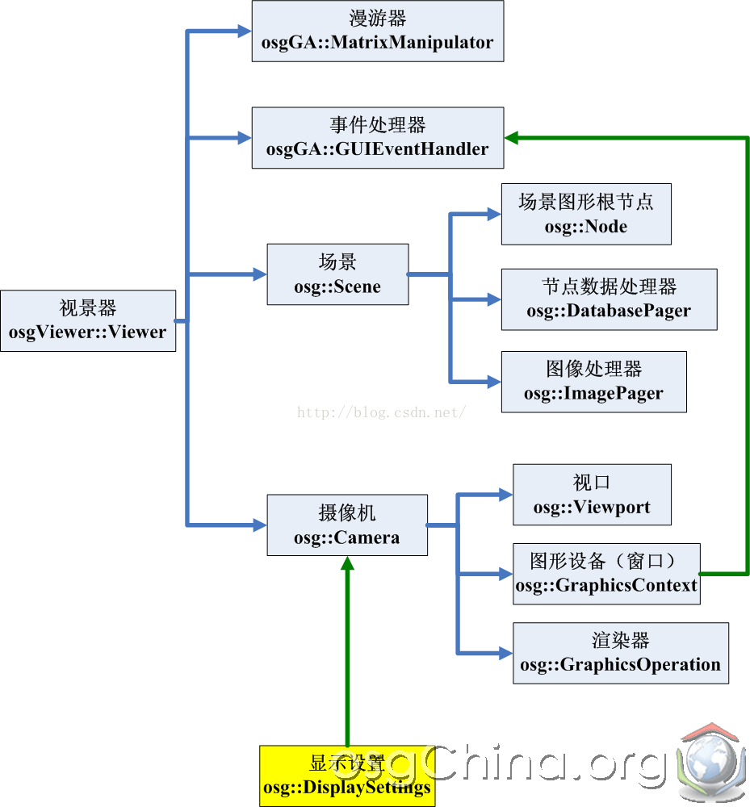

link:  
OSG渲染引擎架构——整体认识  
[http://m.blog.csdn.net/wang15061955806/article/details/49679731](http://m.blog.csdn.net/wang15061955806/article/details/49679731)  

&nbsp; &nbsp; &nbsp;  &nbsp; 本文参考<<osg最长一帧\>>, <<OpenSceneGraph三维渲染引擎编程指南\>>, <<OpenSceneGraph三维渲染引擎设计与实践\>> 整理而来,  感谢大牛们的精彩著作.
 相比Ogre来说, Ogre代码很规范, 只是入门资料较少,如果能在学习之前能总体上对架构有个印象就好了, 免得盲人摸象啊, 不过,还好有OSG.

**场景相关:** Node, Geode, Group, Transform, LOD, Camera,  NodeVisitor, NodeCallback

**几何图形:** Drawable, PrimitiveSet, Geometry, Shape, TessellationHints, Simplifier, DelaunayTriangulator, TriStripVisitor, SmoothingVisitor

**渲染相关:** StateSet, Texture, Light, Material,View, ViewerBase, State, RenderLeaf,RenderBin, RenderState,SceneView,CullVisitor,Renderer,GraphicsContext,  Text

**数据加载:** DatabasePager

**平台相关:** OperationThread, GUIEVentHandler 
		 

## 消息事件处理流程:(第8日)   
  
它负责把WM_*消息转化并传递给osgGA::EventQueue消息队列。通常的GUI窗口系统都会将屏幕左上角定义为（0,0），右下角定位为最大。但是OSG的视口坐标系定义为左下角为（0,0）

## 图形设备抽象:

## 摄像机,图形设备,渲染器,场景图,场景视图之间的关系

## OSG渲染引擎的核心部件  

视景器osgViewer::Viewer应该改成osgViewer::View，多个摄像机可以共有一个图形设备。图形窗口的另一个任务是及时把系统和用户交互的事件反馈到事件处理器组中去，观察Win32平台下的窗口设备GraphicsWindowWin32中的handleNativeWindowingEvent函数和它的传入参数，hwnd，msg，lParam，wParam（例如，捕捉WM_HOTKEY系统热键消息，并传递给OSG的事件队列）  

## 渲染场景视图树  
  

OSG中所有的Drawable几何体对象都会自动关联一个StateSet对象，无论用户是否在自己的程序中作了设置。进入渲染后台之后，OSG将为场景生成“状态树”，它是由“状态节点”StateGraph和“渲染叶”RenderLeaf所组成的
    

&nbsp; &nbsp;图中的“状态根节点”和“局部状态节点”都是由状态树自动生成的，其中后者的主要工作是保存和维护一些渲染后台自动创建的渲染属性；而“全局状态节点”则保存一个名为_globalStateSet的渲染状态集对象，它的取值是场景主相机的StateSet，换句话说，任何对状态树的遍历都将首先至场景主相机的渲染状态，然后才是各个节点的渲染状态，这就是_globalStateSet的功能所在。

而整个状态树的构建过程则可以参考上面的场景树结构图，其规则为：

1、状态树是根据渲染状态（stateset）来生成的，那些没有设置StateSet的场景节点将不会影响状态树的构架。

2、场景中的Drawable对象在状态树中被置入分别的渲染叶（RenderLeaf）中，而一个或多个渲染叶必然被一个状态树的末端节点（StateGraph）所拥有。

3、共享同一个渲染状态的Drawable对象（图中_drawable1和_drawable2）在状态树中将置入同一个末端节点。

生成状态树的同时，OSG渲染后台还将生成对应的“渲染树”，其组成为一个RenderStage对象和多个RenderBind对象，如果我们不使用setRenderBinDetails设置StateSet的渲染细节的话，那么所有状态树中的末端节点（其中必然包含一个或多个“渲染叶”）都会按遍历顺序保存到渲染树根节点（渲染台）中。   
   
根据渲染顺序的不同，渲染树生出了三个分支。相应的状态节点置入各个渲染元（RenderBin）分支中，其中渲染细节设置为“RenderBin”的状态节点（StateGraph）所处的渲染元也可称为“不透明渲染元”；而设置为“DepthSortedBin”的状态节点则将其附带的渲染叶（RenderLeaf）送入“透明体渲染元”，预其中采用了按深度值降序的方式排序绘制，以获得正确的透明体渲染结果；未设置渲染细节的状态节点则直接由根节点（渲染台）负责维护。

## 渲染流程1  

## 渲染流程2

## 节点访问

